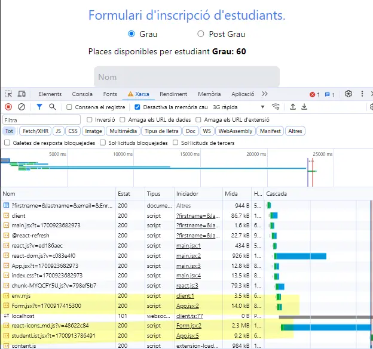

# Solució Repte anterior

Recordem que a l'anterior repte ens va acabar de solucionar la lògica dels tipus d'estudiant quan editàvem les seves dades. 

Anem a veure com solucionar-ho.

Començarem editant el nostre `App.jsx` i afegint dues noves variables d'estat:

```jsx
  const [grauChecked, setGrauChecked] = useState(true)
  const [isRestorePlaces, setIsRestorePlaces] = useState(false)
```

La primera ens permetra guardar l'estat del checkbox (radio) del tipus d'estudiant. Si és `true` és que tenim la opció `Grau` seleccionada. La segona ens permetrà identificar quan estem editant un usuari i si és necessari canviar el nombre de places disponibles en funció de la selecció del tipus d'estudiant.

Alguns canvis necessaris a `App.jsx`:

```jsx
  <li className="parentLabels my-2 flex items-center justify-evenly">
            <label className="radioLabel">
              <input
                type="radio"
                value="Grau"
                name="programGroup"
                checked={grauChecked}
                className="radioInput mr-2"
                onChange={handleChange}
              />
              Grau
            </label>
            <label className="radioLabel">
              <input
                type="radio"
                value="PostGrau"
                name="programGroup"
                checked={!grauChecked}
                className="radioInput mr-2"
                onChange={handleChange}
              />
              Post Grau
            </label>
          </li>
```
Abans de continuar; no és bona pràctica fer ús d'un `onChange` fora d'un input. Anteriorment teníem un de sol sobre el `li` i aquí veruàs que cada `input` té el seu propi `onChange`. En qualssevol cas, es dispararà de la mateixa manera. 

Pel que fa a la propietat `checked` ens permetrà tenir el botó radio seleccionat correctament. Hem de ser coherents amb la nostra lògica i prou: en el cas que volguem que `Grau` estigui marcat, `grauChecked` haurà de ser `true` (valor inicialitzat) i viceversa en el cas de `PostGrau`.

Defiim la funció que ens permetrà dur a terme això:

```jsx
 const setSelectedProgram = (selProgram) => {
    selProgram === 'Grau' ? setGrauChecked(true) : setGrauChecked(false);
    setIsRestorePlaces(true);
  };
```

Aquesta funció, que es dispararà quan volguem editar (això ho farem més endavant al `Form`) rebrà com a paràmetre el tipus d'estudiant (`grau` o `postgrau`) seleccionat en aquell instant i modificarà, si fos necessari, la variable `grauChecked` perquè seleccioni el tipus de programa de l'estudiant a editar. 

També, i això és important, actualitzarem la variable d'estat `isRestorePlaces` que ens permetrà definir que hem entrat en mode edició i aplicar una lògica concreta cada cop que canviem el tipus d'estudiant abans de guardar els canvis.

Encara en falta actualitzar el nombre de places disponibles de la manera correcta, que ho implementarem més endavant amb la funció `handleChange`. 

Abans però anem a veure com cridem aquesta funció `setSelectedProgram`. Ho hauríem de fer des del `Form.jsx` ja que necessitem que reaccioni quan editem un usuari. Comencem passant la funció com a prop al component `Form.jsx`:

```jsx
    <Form
        tipusEstudiantSelect={tipusEstudiant}
        setPlacesDisponibles={setPlacesDisponibles}
        placesActuals={tipusEstudiant === 'PostGrau' ? gPlaces : ngPlaces}
        setDetallsEstudiant={setDetallsEstudiant}
        handleItemSelection={handleItemSelection}
        setSelectedProgram={setSelectedProgram}
        setIsRestorePlaces={setIsRestorePlaces}
      />
``` 
També he passat la funció `setIsRestorePlaces` perquè serà necessària per alguna acció que explicarem més endavant. 

Al `Form`, al nostre botó d'edició, afegirem també el tipus d'estudiant seleccionat com a paràmetre de la funció de callback `handleEdit`:

```jsx
edit: (
        <MdEdit
          className="text-3xl text-blue-500 hover:text-red-500"
          onClick={() => handleEdit(id, props.tipusEstudiantSelect)}
        />
      ),
```

I quan s'executi actualitzarem la variable d'estat a través del prop `setSelectedProgram`. Aquesta invocarà la funció de l'`App.jsx` que hem definit abans:

```jsx
 const handleEdit = (studentID, program) => {
    handleInputReset(firstName, lastName, email);
    setStudentID(studentID);
    setBtnValue('Actualitzar');
    props.setSelectedProgram(program);
  };
```

Tornem a l'`App.jsx` i anem a veure com modificar la funció `handleChange` perquè actualitzi el nombre de places disponibles de la manera correcta. Abans però, el meu objectiu ha estat el següent: 

- Si estic editant un usuaria i canvio el tipus d'estudiant, vull que el nombre de places disponibles finals quedi modificat ja en temps real. És a dir, el número de places que s'ha de mostrar al Formulari en tot moment ha de ser ja el nombre de places disponibles finals abans de fer click al botó `Actualitzar`. 

Un altra lògica hagués pogut ser que el nombre de places disponibles es mantingués igual fins que no es fes click al botó `Actualitzar`.

Dit això, veiem el nostre codi:

```jsx
  const handleChange = (e) => {
    setTipusEstudiant(e.target.value);
    setGrauChecked(!grauChecked);
    if (isRestorePlaces) {
      if (e.target.value === 'Grau') {
        setNGPlaces(ngPlaces - 1);
        setGPlaces(gPlaces + 1);
      } else {
        setGPlaces(gPlaces - 1);
        setNGPlaces(ngPlaces + 1);
      }
    }
  };
```
Hem afegit la funcio `setGrauChecked(!grauChecked)` perquè quan canviem el tipus d'estudiant, el botó radio quedi seleccionat de la manera correcta. És tan fàcil com invertir el valor de la variable d'estat `grauChecked` que tenim definida. A continuació hem afegit la condició `if (isRestorePlaces)` que sumarà o restarà una plaça en funció del tipus d'estudiant que s'hagi seleccionat.

Què ens faltaria? Doncs que un cop l'usuari faci click al botó d'actualitzar, sortim d'aquesta fase d'edició i per tant hem de tornar a posar la variable `isRestorePlaces` a `false`. Això ho hem de gestionar des del `Form` ja que recordem que gestionem afegir i modificar usuaris amb el mateix botó:

```jsx
const handleClick = (event) => {
    handleInputReset('', '', '');
    if (btnValue === 'Inscripció') {
      props.setPlacesDisponibles(props.placesActuals - 1);
    } else {
      props.setIsRestorePlaces(false);
    }
    // Generació d'un ID per l'estudiant - 4digit
    const randomKey = Math.floor(1000 + Math.random() * 9000);
    ...
```

Al prinicipi de la lògica del callback `handleClick` comprovem si el botó té el valor `Inscripció` o `Actualitzar` i en funció d'això, restem una plaça disponible o simplement posem la variable `isRestorePlaces` a `false` (per això necessitàvem passar la funció per modificar-la com a prop!). En el cas d'editar l'usuari, com  que ja hem fet la suma/resta pertinent, no cal que ho tornem a fer.

Tens el codi disponible fins aquest punt. 

# React 4 - Rethinking React

Anem a veure alguns detalls que ens facin repensar i condiserar algunes de les decisions que hem pres fins ara: Re-think, re-design, re-build, re-structure ReactApps

En aquesta secció veurem com fer **code splitting**. Veurem la funció de `React.lazy` i `Suspense` que ens permetrà carregar components de manera dinàmica. Aplicarem code-splitting a la nostra aplicació i veurem alguns punts crítics d'aquesta. També veurem què és el concepte de **props drilling** i com evitar-ho.

Un cop vist això amb l'aplicació que hem fet fins ara, crearem una nova SPA (Single Page Application). A través d'aquesta, donarem suport a diferents vistes segons usuari. A través d'aquesta aprendrem algunes noves idees i conceptes sobre la interacció entre components i en concret sobre **React fragments**. També veurem algunes característiques força noves de React com ara **React Context** que ens permet gestionar l'estat de l'aplicació de manera global sense els problemes de **props drilling**. 

## React Lazy & Suspense

Pensa en l'aplicació que hem fet fins ara. Tenim el `Form` i `studentList`, però quan carreguem inicialment l'aplicació, cal realment carregar tots els components? La llista d'estudiants és necessària? Realment no, està buida de fet.

Això ho podem aconseguir a través del que anomenem **code splitting**. És a dir, carregar els components de manera dinàmica quan realment els necessitem. Com pots imaginarte, això és especialment important en el cas d'aplicacions SPA (Single Page Application) conforme van creixent.

Per aconseguir-ho, React ens proporciona una funció `React.lazy` que ens permet carregar components de manera dinàmica. Anem a incorporar-ho en el nostre projecte:

```jsx
import React, { useState, Suspense } from 'react';
import Form from './components/Form';
const StudentList = React.lazy(() => import('./components/StudentList'));
```
Com pots veure, hem importat el component `StudentList` de manera dinàmica. Això vol dir que no es carregarà fins que no el necessitem. Això ho podem fer gràcies a la funció `React.lazy`. A més necessitarem el hook `Suspense` de React.

Ara ves al final del teu `App.jsx` i envolta el `StudentList` amb el `Suspense`:

```jsx
<Suspense fallback={<div>Loading...</div>}>
        <StudentList
          detallsEstudiant={detallsEstudiant}
          setDetallsEstudiant={setDetallsEstudiant}
          action={action}
          setAction={setAction}
          selectedItemId={selectedItemId}
          restaurarPlaces={restaurarPlaces}
        />
      </Suspense>
```
Hem embolcallat el `StudentList` amb el `Suspense` i li hem passat un `fallback` que és el que es mostrarà en cas que el component no pugui carregar-se.

Si fas ús de la pestanya `Network` o `Xarxa` de l'inspector del navegador, veuràs que el component `StudentList` no s'ha carregat fins el final. Els diferents components arriben en diferents **chunks**. Pots simular-ho amb una connexió lenta a través de les DevTools del navegador i veuràs durant uns segons el missatge `Loading...` que hem definit al `fallback`.



Pots fer la comparació fent ús i sense ús de `React.lazy` i `Suspense` per veure la diferència.

## Props Drilling

Amb **Props Drilling** ens referim a la situació en la que un component necessita passar una prop a un altre component que no té res a veure amb ell. Això pot ser un problema quan tenim molts components anidats i necessitem passar una prop a un component molt llunyà.

Anem a veure si podem fer algunes millores en la nostra aplicació sense necessitat de fer ús de **React Context** ara per ara. 

Modificarem el projecte per mirar de passar el programa directament a la llista d'estudiants sense necessitat de que s'origini al component `Form`. Anem a modificar el codi d'aquests tres components en tres passos:

### 1. App.jsx

Evitarem passar la informació rleativa al tipus d'estudiant i les places disponibles a través del `Form`. 

```jsx
  <Form
        setDetallsEstudiant={setDetallsEstudiant}
        handleItemSelection={handleItemSelection}
        setIsRestorePlaces={setIsRestorePlaces}
      />
```

Abans estàvem passant fins a 7 props al `Form` i ara només en passarem 3. Recordem que feien aquestes funcions:

- `setDetallsEstudiant`: guarda les dades introduïdes al formulari a la variable d'estat `detallsEstudiant` de l'`App.jsx`.
- `handleItemSelection`: guarda la ID de l'estudiant i l'acció a realitzar en les variables d'estat corresponents (`selectedItemId` i `action`) de l'`App.jsx`.

Abans teníem aquí també les variables i funcions corresponents amb el tipus d'estudiant, les places i les seves funcions de modificació. Ara ho farem directament a la llista d'estudiants. Afegim-ho:

```jsx
 <StudentList
          detallsEstudiant={detallsEstudiant}
          setDetallsEstudiant={setDetallsEstudiant}
          action={action}
          setAction={setAction}
          selectedItemId={selectedItemId}
          restaurarPlaces={restaurarPlaces}
          setPlacesDisponibles={setPlacesDisponibles}
          updatedPlaces={tipusEstudiant === 'PostGrau' ? gPlaces : ngPlaces}
          tipusEstudiant={tipusEstudiant}
          setSelectedProgram={setSelectedProgram}
        />
```

### 2. Form.jsx

Hem de desfer-nos de tota referència al tipus d'estudiant i les places disponibles. A més, quan l'usuari faci click al botó d'actualitzar, hem de passar l'ID de l'estudiant i l'acció a l'`App.jsx`. 

Identifiquem la nostra funció `handleEdit` i modifiquem el codi:

```jsx
  const handleEdit = (studentID) => {
    handleInputReset(firstName, lastName, email);
    setStudentID(studentID);
    setBtnValue('Actualitzar');
    props.handleItemSelection('edit', studentID);
  };
```

Hem eliminat el paràmetre `program` ja que no el necessitem. A més, hem canviat la funció `props.setSelectedProgram(program)` per `props.handleItemSelection('edit', studentID)` de manera similar a com ho havíem fet pel cas de `handleDelete`. Cada cop que editem, es llançarà aquesta funció que actualitzarà les variables d'estat `selectedItemId` i `action` de l'`App.jsx`. I aquestes variables ja les hem passat com a props al `StudentList`.

Següent funció, la de `handleClick`:

```jsx
 const handleClick = (event) => {
    handleInputReset('', '', '');
 
    // Generació d'un ID per l'estudiant - 4digit
    const randomKey = Math.floor(1000 + Math.random() * 9000);

    // Si estem fent una inscripció, generem un ID nou, sino assignem l'ID de l'estudiant
    const id = btnValue === 'Inscripció' ? randomKey : studentID;
    if (btnValue !== 'Inscripció') {
      props.setIsRestorePlaces(false);
    }
    props.setDetallsEstudiant({
      key: id,
      fname: firstName,
      lname: lastName,
      program: props.tipusEstudiantSelect,
      email: email,
      edit: (
        <MdEdit
          className="text-3xl text-blue-500 hover:text-red-500"
          onClick={() => handleEdit(id)}
        />
      ),
      delete: (
        <MdDelete
          className="text-3xl text-blue-500 hover:text-red-500"
          onClick={() => props.handleItemSelection('delete', id)}
        />
      ),
    });
    setBtnValue('Inscripció');
    event.preventDefault(); // Necessari per evitar que el form es refresqui
  };
```
Únicament la part de codi on  actualitzàvem les places actuals amb `props.setPlacesDisponibles(props.placesActuals - 1)` ha canviat. Ara ho farem a la llista d'estudiants. I també podem prescindir del paràmetre per passar el tipus d'estudiant o program al callback de `handleEdit`. 

### 3. StudentList.jsx

Ara haurem de fer les modificacions relatives al tipus d'estudiant i les places disponibles al component `StudentList`.

Comencem amb dues modificacions clares que hem d'afegir al nostre `useEffect`. Al final d'aquest hauríem d'afegir:

```jsx
    props.detallsEstudiant.program = props.tipusEstudiant;
    props.setPlacesDisponibles(props.updatedPlaces);
```

La primera línia farà que el tipus d'estudiant/programa s'actualitzi correctament en funció del que tenim seleccionat al formulari. Ja no és el `Form` l'encarregat de passar aquesta informació. Ho fem tot d'acord amb l'element seleccionat a través del `RadioGroup` del `App.jsx`.

A la segona línia actualitzarem el nombre de places disponibles en funció del tipus d'estudiant seleccionat. Això ho fem a través de la funció `setPlacesDisponibles` que hem passat com a prop al `StudentList` i que hem definit a l'`App.jsx`. Això ho feiem abans al `Form` a través de la funció que es disparava amb el botó. 

Ara per ara hauria de funcionar la opció de borrar. Prova a veure si tot ok. 


